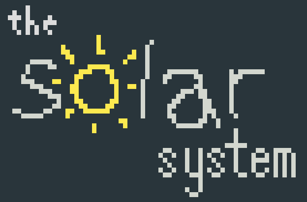

**S**torage and 
**O**ther 
**L**ayers 
**A**dded to 
**R**elays

The Solar System facilitates uploading files and sharing files over the nostr network, as well as
leveraging user identity to build extra features into the network using a simple API.

By default, SOLAR provides invitation, registration, and upload endpoints.
